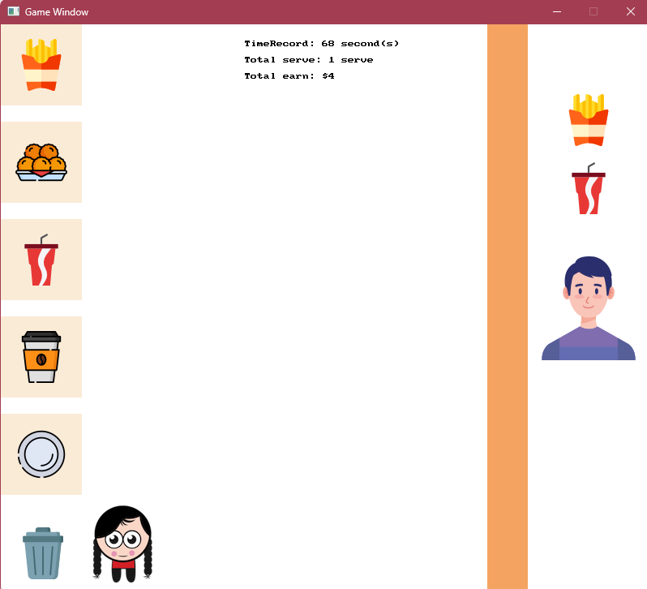

# CookingDash SplashKit
Simple Cooking Dash game built with SplashKit programming SDK (C#). 

Live demo at: [YouTube](https://youtu.be/Jes0L1UmNCA)



## About Gameplay
The customer will randomly generate an order, which is a combination of food (Chips or Nuggets) and drinks (CocaCola or Coffee).

The player can move around the map, press `A` to interact with objects, pick up food and drinks, place them on a plate, and deliver the plate to the customer to earn money.

The player can only carry 1 type of food (in the left hand) and 1 type of drink (in the right hand), or a combination plate (in both hands).
If the player accidentally picks up the wrong object, they can press `D` near the bin to discard all objects they are holding.

## Installation
1. SplashKit can be install by following the official instruction: [Windows (MSYS2) Installation Overview | SplashKit](https://splashkit.io/installation/windows-msys2/)
2. Open the terminal
3. Clone this repo

    ```git clone https://github.com/TUT888/SplashKit-FoodServingGame.git```
4. Run the program

    ```skm dotnet run```
5. Quit the game by pressing `ESC` key.
